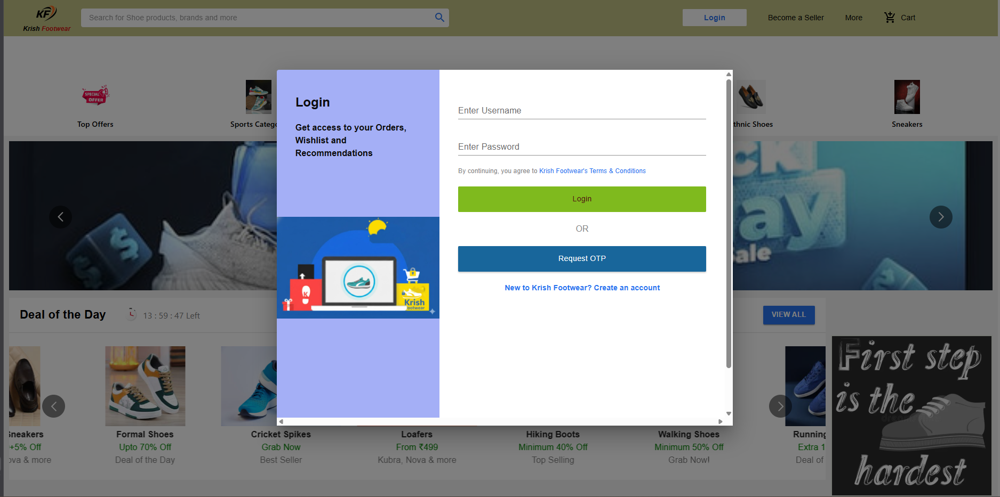
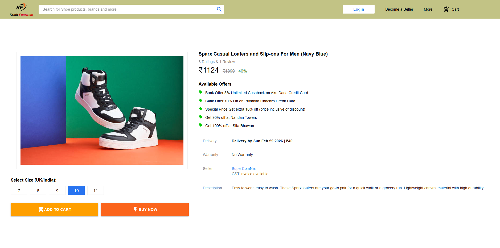
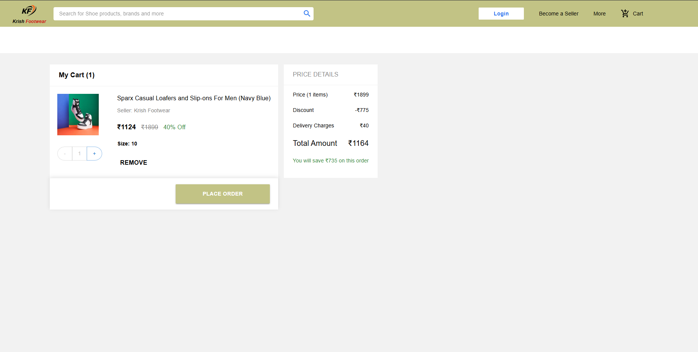
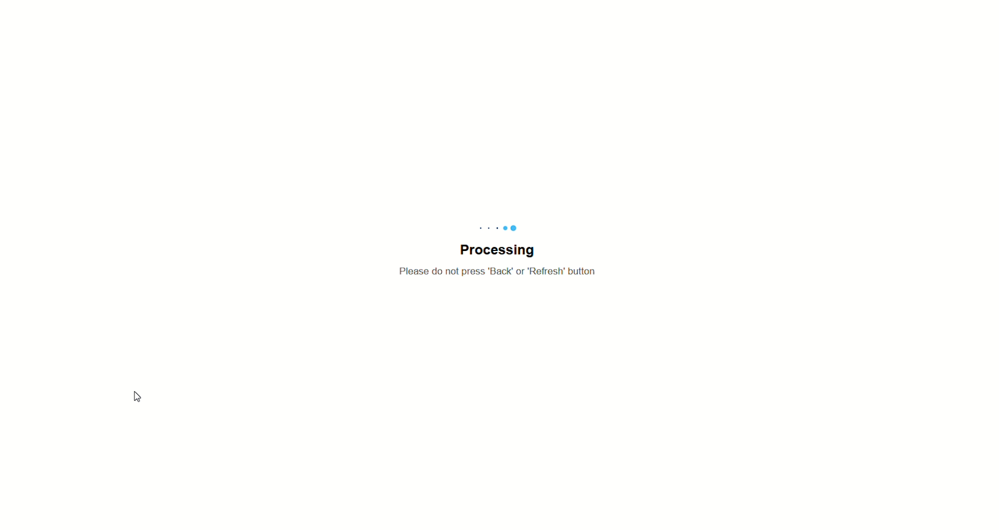
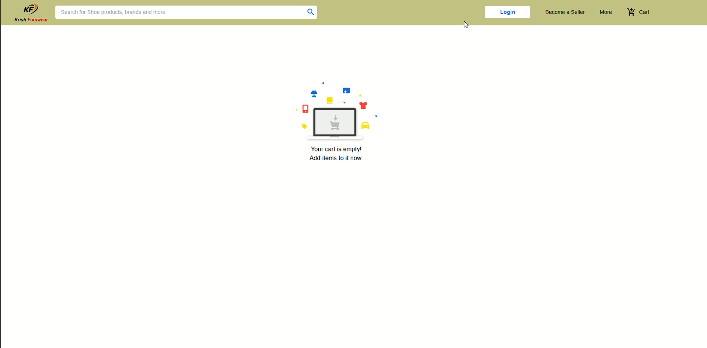

# 👟 KRISH FOOTWEAR

A Full Stack MERN E-Commerce Web Application for footwear shopping with secure authentication and integrated payment gateway.

Built with modern scalable architecture and cloud database infrastructure.

---

## 🚀 Live Demo

Coming Soon...

---

## 🧱 System Architecture & Tech Stack

Krish Footwear follows a full-stack MERN architecture with secure authentication, cloud database storage, and integrated payment processing.

---

### 🎨 1. Frontend (Client Side)

- **React.js** – Dynamic and interactive UI development
- **Material UI (MUI)** – Modern, responsive, and professional UI components
- **Redux** – Centralized state management for:
  - Shopping cart handling
  - User session persistence
  - Global application state

---

### ⚙️ 2. Backend (Server Side)

- **Node.js** – Server-side JavaScript runtime
- **Express.js** – RESTful API framework
- **JWT (JSON Web Tokens)** – Secure authentication & protected routes

---

### 🗄️ 3. Database & Storage

- **MongoDB Atlas** – Cloud-based NoSQL database
  - Stores product records
  - Manages user accounts
  - Handles order data

- **Automated Data Synchronization**
  - Clears outdated records on server startup
  - Repopulates fresh product data
  - Maintains database consistency

---

### 🔐 4. Third-Party Integrations & Security

- **Paytm Payment Gateway**
  - Secure financial transaction processing
  - Checkout verification system

- **Dotenv**
  - Secure environment variable management
  - Protects:
    - Database credentials
    - JWT secrets
    - API keys

- **Git Security Best Practices**
  - Proper `.gitignore` configuration
  - Prevents pushing:
    - `.env`
    - `node_modules`
    - Sensitive credentials

---

## ✨ Key Features

- 🛍️ Product Listing & Details Page
- 🔍 Dynamic Routing
- 🛒 Add to Cart with Redux
- 🔐 JWT Authentication System
- 👤 Protected User Routes
- 💳 Integrated Paytm Payment Gateway
- 📦 Order Management
- 📱 Fully Responsive Design

---

## 📸 Project Screenshots

### 🏠 Homepage
<p align="center">
  
</p>

---

### 🔐 Login Page
<p align="center">
  
</p>

---

### 👟 Product Page
<p align="center">
  
</p>

---

### 🛒 Cart Page
<p align="center">
  
</p>

---

### 💳 Payment Page
<p align="center">
  
</p>

---

### 🧺 Empty Cart
<p align="center">
  
</p>

---

---

---

## 📂 Project Structure

```
KRISH-FOOTWEAR
│
├── client        # React + Redux Frontend
├── server        # Node + Express Backend
├── assets        # Screenshots
├── package.json
└── README.md
```

---

## ⚙️ Installation & Setup

### 1️⃣ Clone the Repository

```bash
git clone https://github.com/Kishlaya20sinha/krish-footwear.git
```

### 2️⃣ Install Dependencies

#### Root
```bash
npm install
```

#### Client
```bash
cd client
npm install
```

#### Server
```bash
cd server
npm install
```

### 3️⃣ Run the Application

#### Start Backend
```bash
cd server
npm start
```

#### Start Frontend
```bash
cd client
npm start
```

---

## 🏗️ Architecture Flow

```
React + Redux (Frontend)
        ↓
Express REST API (Node.js Backend)
        ↓
MongoDB Atlas (Cloud Database)
        ↓
Paytm Gateway (Payment Processing)
```

---

## 📈 Future Enhancements

- ⭐ Product Reviews & Ratings
- ❤️ Wishlist Feature
- 📊 Admin Dashboard Analytics
- ☁️ Cloud Deployment (AWS / Render / Vercel)
- 🔔 Email Notifications

---

## 👨‍💻 Author

**Kishlaya Sinha**  
B.Tech CSE | Full Stack Developer | ML Enthusiast  

🔗 GitHub: [Kishlaya20sinha](https://github.com/Kishlaya20sinha)  
🔗 LinkedIn: [Kishlaya Sinha](https://www.linkedin.com/in/kishlaya-sinha-9134a0211/)

---

## ⭐ Show Your Support

If you like this project, consider giving it a ⭐ on GitHub!
